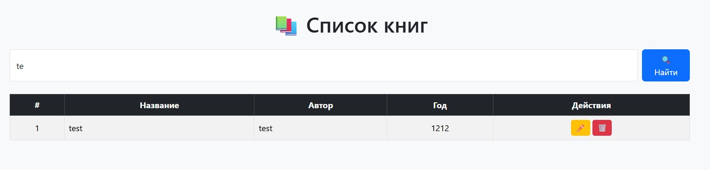

# Практическая работа №2.3: HTTP-сервер с отдачей статического контента

## 🎯 Цель работы

Научиться отдавать статические HTML-страницы через Django и встроенный HTTP-сервер, понимать базовые принципы маршрутизации и шаблонов.

---

## 💡 Условие

Реализовать простейший HTTP-сервер, который по запросу клиента отображает HTML-страницу с оформлением.
Страница должна содержать приветственный текст, стилизованный с помощью CSS.

---

## 🧩 Код программы

### `views.py`

```python
from django.http import HttpResponse

def index(request):
    html = """
    <!DOCTYPE html>
    <html lang="ru">
      <head>
        <meta charset="utf-8">
        <title>Socket HTTP Server</title>
        <style>
          body {
            margin: 0;
            font-family: "Segoe UI", Roboto, sans-serif;
            background: linear-gradient(135deg, #1e3c72, #2a5298);
            color: #fff;
            height: 100vh;
            display: flex;
            align-items: center;
            justify-content: center;
          }
          .card {
            background: rgba(255,255,255,0.1);
            backdrop-filter: blur(8px);
            border-radius: 16px;
            padding: 2rem 3rem;
            text-align: center;
            box-shadow: 0 8px 20px rgba(0,0,0,0.3);
            animation: fadeIn 1s ease;
          }
          h1 { font-size: 2.2rem; margin-bottom: 1rem; }
          p { font-size: 1.2rem; }
          a {
            color: #1e3c72;
            background: #fff;
            border-radius: 8px;
            padding: 0.6rem 1.2rem;
            text-decoration: none;
            font-weight: bold;
            transition: all 0.2s ease;
          }
          a:hover { background: #f1f1f1; transform: translateY(-2px); }
          @keyframes fadeIn {
            from { opacity: 0; transform: translateY(20px); }
            to { opacity: 1; transform: translateY(0); }
          }
        </style>
      </head>
      <body>
        <div class="card">
          <h1>Добро пожаловать!</h1>
          <p>Эта страница отдана простым Django HTTP-сервером.</p>
          <p>Красиво, лаконично и просто ❤️</p>
          <a href="https://www.python.org/">На сайт Python</a>
        </div>
      </body>
    </html>
    """
    return HttpResponse(html)
```

---

### `urls.py`

```python
from django.urls import path
from . import views

urlpatterns = [
    path("", views.index, name="index"),
]
```

---

### `settings.py` (фрагмент)

Добавляем приложение в список установленных:

```python
INSTALLED_APPS = [
    ...,
    "simple_page",  # наше приложение
]
```

---

## 🚀 Запуск

1. Запустить сервер разработки Django:

   ```bash
   python manage.py runserver
   ```

2. Перейти в браузере по адресу:

   ```
   http://127.0.0.1:8000/
   ```

3. На экране появится оформленная страница с приветствием и кнопкой-ссылкой.

---

## 📸 Пример результата



---

## 🧾 Выводы

1. Реализован минимальный веб-сервер, отдающий HTML-страницу.
2. Освоены основы маршрутизации и формирования HTTP-ответов в Django.
3. Добавлено современное оформление с помощью CSS и анимации.
4. Работа демонстрирует связь серверной логики и визуальной части веб-приложений.
