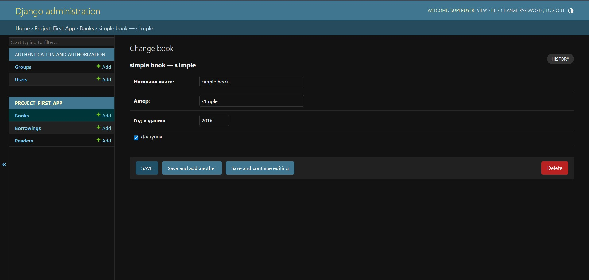

# Практическая работа №2.3: Реализация представлений, шаблонов и Bootstrap

## Цель работы

Научиться создавать представления (**views**), маршруты (**urls**) и шаблоны (**templates**) в Django, а также оформить интерфейс с помощью **Bootstrap 5**.

---

## Ход работы

### 1. Создание представления в `views.py`

```python
from django.shortcuts import render, get_object_or_404
from django.core.paginator import Paginator
from .models import Reader, Book

def reader_detail(request, reader_id):
    reader = get_object_or_404(Reader, pk=reader_id)
    return render(request, 'reader_detail.html', {'reader': reader})

def book_list(request):
    query = request.GET.get("q", "")
    books = Book.objects.all()
    if query:
        books = books.filter(title__icontains=query) | books.filter(author__icontains=query)

    paginator = Paginator(books, 5)
    page_number = request.GET.get("page")
    page_obj = paginator.get_page(page_number)
    return render(request, "books/book_list.html", {"page_obj": page_obj, "query": query})
```

---

### 2. Настройка маршрутов в `urls.py` приложения

```python
from django.urls import path
from . import views

urlpatterns = [
    path('reader/<int:reader_id>/', views.reader_detail, name='reader_detail'),
    path('', views.book_list, name='book_list'),
]
```

---

### 3. Подключение маршрутов приложения в основном `urls.py` проекта

```python
from django.contrib import admin
from django.urls import path, include

urlpatterns = [
    path('admin/', admin.site.urls),
    path('', include('project_first_app.urls')),
]
```

---

### 4. Создание шаблонов

#### 📄 `project_first_app/templates/reader_detail.html`

```html
<!DOCTYPE html>
<html lang="ru">
  <head>
    <meta charset="UTF-8" />
    <title>Информация о читателе</title>
    <link
      href="https://cdn.jsdelivr.net/npm/bootstrap@5.3.2/dist/css/bootstrap.min.css"
      rel="stylesheet"
    />
  </head>
  <body class="bg-light">
    <div class="container py-5">
      <div class="card shadow-sm p-4">
        <h2 class="mb-3 text-center">📖 Информация о читателе</h2>
        <p><strong>Имя:</strong> {{ reader.first_name }}</p>
        <p><strong>Фамилия:</strong> {{ reader.last_name }}</p>
        <p><strong>Электронная почта:</strong> {{ reader.email }}</p>
        <p>
          <strong>Дата регистрации:</strong> {{ reader.created_at|date:"d.m.Y"
          }}
        </p>
        <div class="text-center mt-4">
          <a href="/admin/project_first_app/reader/" class="btn btn-primary">
            ⬅ Назад в админку
          </a>
        </div>
      </div>
    </div>
  </body>
</html>
```

---

#### 📄 `project_first_app/templates/books/book_list.html`

```html
<!DOCTYPE html>
<html lang="ru">
  <head>
    <meta charset="UTF-8" />
    <title>Список книг</title>
    <link
      href="https://cdn.jsdelivr.net/npm/bootstrap@5.3.2/dist/css/bootstrap.min.css"
      rel="stylesheet"
    />
  </head>
  <body class="bg-light">
    <div class="container py-5">
      <h2 class="mb-4 text-center">📚 Список книг</h2>

      <form method="get" class="mb-4 d-flex justify-content-center">
        <input
          type="text"
          name="q"
          value="{{ query }}"
          class="form-control w-50 me-2"
          placeholder="Поиск по названию или автору..."
        />
        <button type="submit" class="btn btn-primary">🔍 Найти</button>
      </form>

      <table class="table table-striped table-bordered align-middle">
        <thead class="table-dark text-center">
          <tr>
            <th>#</th>
            <th>Название</th>
            <th>Автор</th>
            <th>Год</th>
            <th>Наличие</th>
          </tr>
        </thead>
        <tbody>
          
          <tr>
            <td class="text-center">{{ forloop.counter }}</td>
            <td>{{ book.title }}</td>
            <td>{{ book.author }}</td>
            <td class="text-center">{{ book.year }}</td>
            <td class="text-center">
               ✅  ❌ 
            </td>
          </tr>
          
          <tr>
            <td colspan="5" class="text-center text-muted">
              Нет доступных книг
            </td>
          </tr>
          
        </tbody>
      </table>

      <nav aria-label="Навигация страниц">
        <ul class="pagination justify-content-center">
          
          <li class="page-item">
            <a
              class="page-link"
              href="?page={{ page_obj.previous_page_number }}&q={{ query }}"
              >←</a
            >
          </li>
            
          <li class="page-item active">
            <span class="page-link">{{ num }}</span>
          </li>
          
          <li class="page-item">
            <a class="page-link" href="?page={{ num }}&q={{ query }}"
              >{{ num }}</a
            >
          </li>
            
          <li class="page-item">
            <a
              class="page-link"
              href="?page={{ page_obj.next_page_number }}&q={{ query }}"
              >→</a
            >
          </li>
          
        </ul>
      </nav>
    </div>
  </body>
</html>
```

---

### 5. Проверка работы

```bash
python manage.py runserver
```

Адреса для проверки:

- **[http://127.0.0.1:8000/](http://127.0.0.1:8000/)** — список книг с поиском и пагинацией.
- **[http://127.0.0.1:8000/reader/1/](http://127.0.0.1:8000/reader/1/)** — страница информации о читателе.

---

## Результаты

- Реализованы представления `reader_detail` и `book_list`.
- Внедрена пагинация и поиск по названию и автору.
- Настроена маршрутизация между проектом и приложением.
- Созданы HTML-шаблоны с использованием **Bootstrap 5**.
- Проверена корректная передача данных из модели в шаблон.

---

## Скриншоты работы

**1. Добавление данных через админ-панель:**


**2. Отображение информации о читателе (страница клиента):**


---

## Выводы

1. Освоено создание маршрутов, представлений и шаблонов в Django.
2. Реализована пагинация и поиск в списках данных.
3. Применён Bootstrap для стилизации интерфейса и улучшения внешнего вида.


